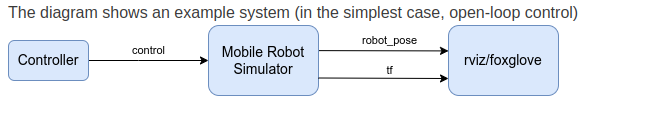
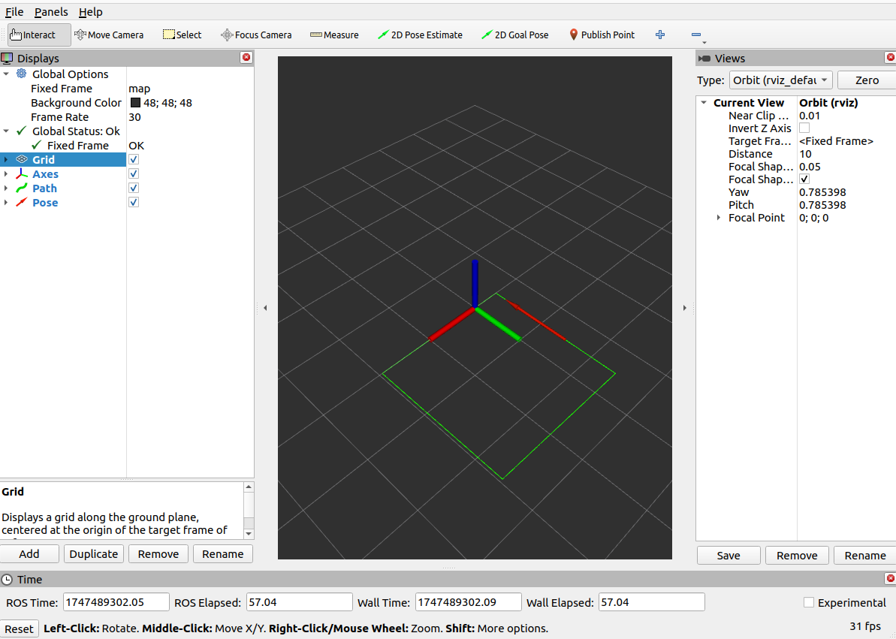

# Mobile Robot Simulation – ROS2 Project

## Overview

This ROS2 package simulates the motion of a mobile robot using a unicycle kinematic model. The robot receives linear (`u1`) and angular (`u2`) velocity commands and publishes its pose and trajectory for visualization.

## System Components

- **Simulator Node**
  - Implements:
    ```
    ẋ = u1 * cos(ϕ)
    ẏ = u1 * sin(ϕ)
    ϕ̇ = u2
    ```
  - Publishes:
    - `robot_pose` (`PoseStamped`)
    - `tf` from `world` to `base_link`
  - Defaults to zero control if no command is received.

- **Controller Node**
  - Generates control inputs (`u1`, `u2`)
  - Sends commands to simulator
  - Can simulate motion patterns (e.g., square path)

## How to Launch

```bash
ros2 launch mobile_robot_simulator simulation_launch.py
```

- Parameters are loaded from YAML config files.
- All nodes start from the launch file.

## Visualization

- Use RViz or Foxglove to view:
  - `/robot_pose`
  - `/trajectory`
  - `tf` between `world` and `base_link`

## System Diagram





## Notes

- Motion is limited to the XY plane (z = 0)
- Initial pose: (0, 0, 0)
- The robot should move in a meaningful trajectory

